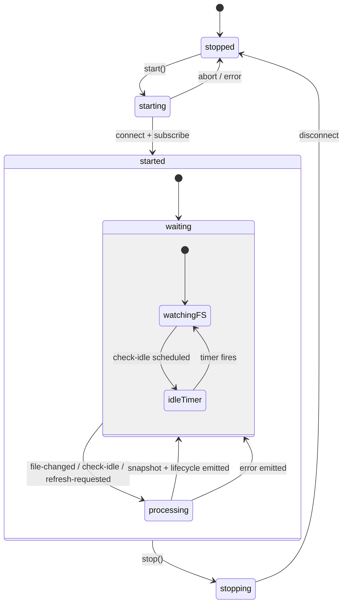

# @agentprobe/core

[](https://github.com/vtemian/agentprobe/actions/workflows/quality-gate.yml)
[](https://www.npmjs.com/package/@agentprobe/core)
[](https://opensource.org/licenses/MIT)

**A TypeScript library that turns AI coding agent transcripts into normalized, real-time event streams.**

Unlike traditional observability tools (AgentOps, LangSmith) that require active instrumentation of your LLM calls, AgentProbe uses **Passive Observability**. It parses the artifacts (transcripts, logs) that tools like Cursor and Claude Code already leave behind, giving you real-time visibility into proprietary agents you don't own.

---

It is designed in layers:

- `core`: generic runtime + lifecycle diffing (tool-agnostic)
- `providers/cursor`: Cursor transcript discovery + parsing
- `providers/claude-code`: Claude Code session discovery + parsing
- `providers/codex`: Codex JSONL session discovery + parsing
- `providers/opencode`: OpenCode SQLite database adapter

The core observer API is provider-injected and tool-agnostic. All four providers are enabled by default.

## Install

```bash
npm install @agentprobe/core
```

## Quick Start (Provider-Agnostic)

```ts
import { createObserver } from "@agentprobe/core";

const observer = createObserver({
  workspacePaths: ["/Users/me/my-project"],
});

observer.subscribe((event) => {
  console.log(event.change.kind, event.agent.id, event.agent.status);
});

await observer.start();

// stop() clears all subscriptions and resets state
await observer.stop();
```

`createObserver` enables all four built-in providers (Cursor, Claude Code, Codex, OpenCode) by default. You can pass a custom `providers` array, `debounceMs`, or `checkIdleDelayMs` as needed.

## How Runtime Works

The watch runtime (used by `createObserver`) is built around a state machine and an internal typed event bus that processes events sequentially.



### Event bus

Inside the `started` state, all work flows through a sequential event bus with three event types:

- **`file-changed`**: dispatched after debounced fs.watch events; reads the snapshot and schedules a check-idle timer
- **`check-idle`**: fires on a timer (default 2s); re-reads the snapshot to catch time-based status transitions (e.g. `running` → `idle` → `completed`) and self-reschedules while agents exist
- **`refresh-requested`**: dispatched by `refreshNow()`; reads the snapshot and resolves waiting callers

Events are processed one at a time (no overlapping reads). Subscribers only receive events when agent statuses actually change (joined, statusChanged, left). Heartbeat-only cycles are silent, and the internal polling is invisible to consumers.

### Idle checking

Agent statuses depend on time elapsed since last activity. Without periodic re-evaluation, time-based transitions are missed when transcript files stop changing. The check-idle mechanism solves this:

1. After every `file-changed` or `refresh-requested`, a check-idle timer is scheduled
2. When it fires, the runtime re-reads the snapshot with the current timestamp
3. If agents still exist, the timer self-reschedules
4. Configurable via `checkIdleDelayMs` (default `2000`, set to `false` to disable)

### Lifecycle model

- Internal states: `stopped → starting → started → stopping`
- `start()` connects to the source, installs optional watch subscriptions, emits `started`, and dispatches an initial `file-changed` event
- `stop()` clears timers/subscriptions/bus queue, rejects in-flight waiters, disconnects, and emits `stopped`

### Concurrency and race safety

- A monotonic lifecycle token guards all event dispatch
- Every start/stop cycle advances the token
- Events dispatched with a stale token are silently dropped
- The event bus processes handlers sequentially with no overlapping async work

### Error and stop semantics

- Snapshot/read failures emit `error` and reject cycle waiters
- Calling `refreshNow()` while not running rejects with `NOT_RUNNING`
- Stopping during an active refresh rejects pending waiters with `STOPPED_BEFORE_REFRESH_COMPLETED`

### Watch subscriptions

When a provider exposes `subscribeToChanges`, runtime subscriptions:

- resolve configured/default watch paths
- normalize paths (trim + drop empty + dedupe)
- debounce bursty events before dispatching `file-changed` to the bus
- resubscribe with exponential backoff on subscription failures

## Public Entry Points

- `@agentprobe/core`: full package with all providers, `createObserver` enables all by default
- `@agentprobe/core/core`: core runtime, lifecycle, model, and provider types only
- `@agentprobe/core/providers/cursor`: Cursor transcript provider
- `@agentprobe/core/providers/claude-code`: Claude Code session provider
- `@agentprobe/core/providers/codex`: Codex session provider
- `@agentprobe/core/providers/opencode`: OpenCode database provider

## Development

```bash
npm install
npm run check
npm run build
```

### Scripts

- `npm run format` - format code with Biome
- `npm run lint` - lint code with Biome
- `npm run typecheck` - run TypeScript checking
- `npm run test` - run Vitest suite
- `npm run build` - produce dist bundles with tsup
- `npm run check` - biome check + typecheck + test

## Examples

See the [`examples/`](examples/) directory for 9 self-contained demos, from a minimal observer to a full terminal dashboard and floating macOS overlay.

---

### Why Passive Observability Matters

**Read the full deep-dive on how AgentProbe reconstructs agent lifecycles from Cursor and Claude Code transcripts without instrumentation:**

[AgentProbe: Real-Time Observability for AI Agents](https://blog.vtemian.com/project/agentprobe/)

---

## License

MIT. See `LICENSE`.
