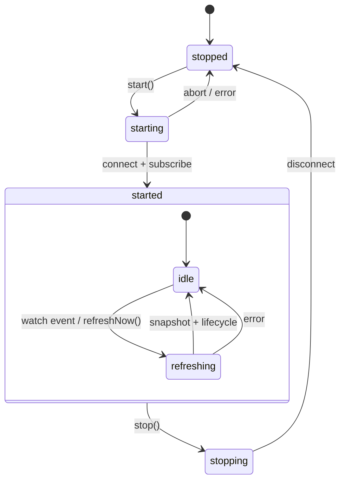

# @agentprobe/core

`@agentprobe/core` is a TypeScript library for observing agent/session activity from transcript-like sources.

It is designed in layers:

- `core`: generic runtime + lifecycle diffing (tool-agnostic)
- `providers/cursor`: Cursor transcript discovery + parsing adapter

The core observer API is provider-injected and tool-agnostic. Cursor is currently the built-in provider, with support planned for Claude Code, Codex, OpenCode, and custom systems.

## Install

```bash
npm install @agentprobe/core
```

## Quick Start (Provider-Agnostic)

```ts
import { createObserver } from "@agentprobe/core";

const observer = createObserver({
  workspacePaths: ["/Users/me/my-project"],
});

const disposeSnapshots = observer.subscribeToSnapshots((event) => {
  console.log(event.snapshot.at, event.snapshot.agents.length);
});

const disposeUpdates = observer.subscribeToAgentChanges((event) => {
  console.log(event.change.kind, event.agent.id);
});

await observer.start();

// later
disposeSnapshots();
disposeUpdates();
await observer.stop();
```

`createObserver` defaults to the built-in Cursor provider. You can still pass a custom `provider` if needed.

## How Runtime Works

The watch runtime (used by `createObserver`) is designed around a small state machine and a single refresh worker.



### Lifecycle model

- Internal states: `stopped -> starting -> started -> stopping`
- `start()` connects to the source, installs optional watch subscriptions, emits `started`, and queues an initial refresh
- `stop()` clears timers/subscriptions, rejects in-flight refresh waiters, disconnects, and emits `stopped`

### Concurrency and race safety

- A monotonic lifecycle token guards async operations
- Every start/stop cycle advances the token
- Late async completions (from older cycles) are ignored when token checks fail

### Refresh flow

- `refreshNow()` queues a waiter and triggers refresh scheduling
- A single worker loop performs `readSnapshot()` cycles (no overlapping reads)
- Each successful cycle emits:
  - `snapshot` (current full snapshot)
  - `lifecycle` (joined/statusChanged/heartbeat/left diffs)
- Waiters for that cycle are resolved with the snapshot

### Error and stop semantics

- Snapshot/read failures emit `error` and reject cycle waiters
- Calling `refreshNow()` while not running rejects with `NOT_RUNNING`
- Stopping during an active refresh rejects pending waiters with `STOPPED_BEFORE_REFRESH_COMPLETED`

### Watch subscriptions

When a provider exposes `subscribeToChanges`, runtime subscriptions:

- resolve configured/default watch paths
- normalize paths (trim + drop empty + dedupe)
- debounce bursty events before triggering refresh
- resubscribe with exponential backoff on subscription failures

## Public Entry Points

- `@agentprobe/core` — full package (core + Cursor provider, `createObserver` defaults to Cursor)
- `@agentprobe/core/core` — core runtime, lifecycle, model, and provider types only
- `@agentprobe/core/providers/cursor` — Cursor transcript provider only

## Development

```bash
npm install
npm run check
npm run build
```

### Scripts

- `npm run format` - format code with Biome
- `npm run lint` - lint code with Biome
- `npm run typecheck` - run TypeScript checking
- `npm run test` - run Vitest suite
- `npm run build` - produce dist bundles with tsup
- `npm run check` - biome check + typecheck + test

## Examples

See:

- `examples/provider-observer.ts` (provider-injected API)

## License

MIT. See `LICENSE`.
